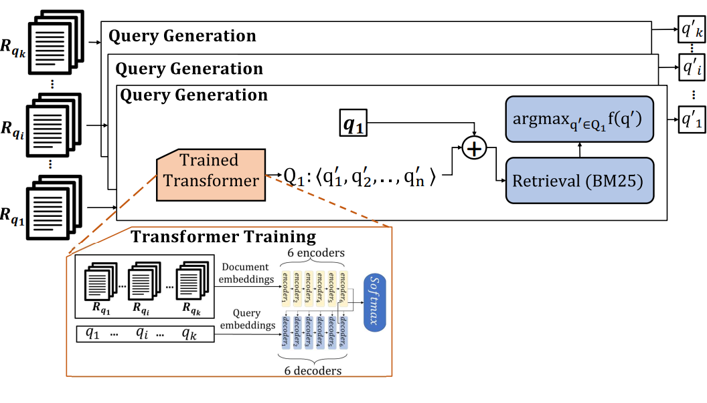

# Matches Made in Heaven: Toolkit and Large-Scale Datasets forSupervised Query Reformulation

With the increasing importance of the query reformulation task,various researchers have already offered different strategies to collectground-truth query translation pairs. The objective of our work is to present a standard approach forgenerating large-scale query pair collections that can be used fortraining supervised query reformulation techniques. To generate a ground-truth query reformulation dataset, We propose a toolkit to first train a transformer architecture and learn the associations between the relevance judgement documents of each query and the query itself. Then, the trained transformer is exploited to generate queries from theset of relevant judgment documents associated with each query. The generated queries are then evaluated based on their effectiveness, e.g.,map or mrr, and the most effective queries are chosen to be pairedwith the original query. 

## Datasets: Details and Evaluation

 Based on MSMARCO training set, we release three datasets for MSMarco, namely,Diamond,Platinum, and Gold datasets. The details and the corresponding link to queries can be found in this table. Queries were retrieved using [BM25 implementation in Anserini](https://github.com/castorini/anserini/blob/master/docs/experiments-msmarco-passage.md). All the queries have relevant judged documents that can be found in [MSMARCO website](https://microsoft.github.io/msmarco/). 


|                           | Number of Queries | MAP (Source Query) | MAP (Revised Query) | MAP Improvement % | MRR@10 (Source Query) | MRR@10 (Revised Query) | MRR@10 Improvement % |
|---------------------------|:-----------------:|:------------------:|:-------------------:|:-----------------:|:---------------------:|:----------------------:|:--------------------:|
| [Diamond Dataset](https://github.com/Narabzad/msmarco-query-reformulation/blob/main/datasets/diamond.tsv)  |      188,398      |        0.139       |        1.000        |       619\%       |         0.126         |          1.000         |         690\%        |
| [Platinum Dataset](https://github.com/Narabzad/msmarco-query-reformulation/blob/main/datasets/platinum.tsv)|      429,192      |        0.086       |        0.582        |       576\%       |         0.074         |          0.593         |         693\%        |
| [Gold Dataset](https://github.com/Narabzad/msmarco-query-reformulation/blob/main/datasets/gold.tsv)    |      502,939      |        0.179       |        0.603        |       236\%       |         0.169         |          0.612         |         260\%        |
 
For instance , to replicate the numbers in the table (retrieve and evaluate the Diamond Dataset) you need to follow these steps: 

1. Installing [Anserini](https://github.com/castorini/anserini)
2. [Index MSMARCO passage collection](https://github.com/castorini/anserini/blob/master/docs/experiments-msmarco-passage.md#data-prep)
3. you may to may the number of threads and the index directory when following this command
```
sh anserini/target/appassembler/bin/SearchMsmarco -hits 1000 -threads 1 \
 -index indexes/msmarco-passage/lucene-index-msmarco \
 -queries diamond.tsv \
 -output runs/run.diamond.train.tsv
```
4. You may evaluate the results on MRR@10 with the folllowing comand :
```
python anserini/tools/scripts/msmarco/msmarco_passage_eval.py \
 qrels.train.tsv runs/run.diamond.train.tsv
```
and the output should be:
```
#####################
MRR @10: 1
QueriesRanked: 188398 
#####################
```

6. You may evaluate the MAP with the following commands:
```
python anserini/tools/scripts/msmarco/convert_msmarco_to_trec_run.py \
 --input runs/run.diamond.train.tsv \
 --output runs/run.diamond.train.trec

python anserini/tools/scripts/msmarco/convert_msmarco_to_trec_qrels.py \
 --input datasets/qrels.diamond.train.tsv \
 --output datasets/qrels.diamond.train.trec
 
anserini/tools/eval/trec_eval.9.0.4/trec_eval -m map qrels.diamond.train.trec runs/run.diamond.train.trec
```
and the output should be:

``` map  all   1 ```

## Datasets: Generation

The overflow of generating the queries are shown in the following Figure which consists of 1) transformer training step and 2) query generation step. 
<p align="center">
    
</p>

### Transformer Training 
We finetuned T5 transformer in order to generate queries from the documents. To finetune T5 on pairs of query and relevant judged passages of MSMArco, we adopted [DocTTTTQuery] methodology and the [details of the trainig can be found here](https://github.com/castorini/docTTTTTquery#learning-a-new-prediction-model-t5-training-with-tensorflow).
The trained model is also [available](https://git.uwaterloo.ca/jimmylin/doc2query-data/raw/master/T5-passage/t5-base.zip) if you do not wish to train the model.

It should be noted that the goal of this training step is being able to  generate  a query that a document can best aswer, given any documents.

### Query Generation

The fine tuned T5 is not deterministic, therefore, we can generate a different query each time we run the model on a document. We run the model (N=25) times to generate N queries for each document in the qrels (relevant judged documents). You can generate N queries given any documents and the fine-tuned model by [following here](https://github.com/castorini/docTTTTTquery#predicting-queries-from-documents-t5-inference-with-tensorflow). 

Further, we evaluate the desiret evaluation metric on the 25 queries and select the one with the best performance. We consider the best performed queries acroox the N generated queries as the target query. If the target query failed to show any improvemet, we keep the original query (it happens in gold dataset) 
